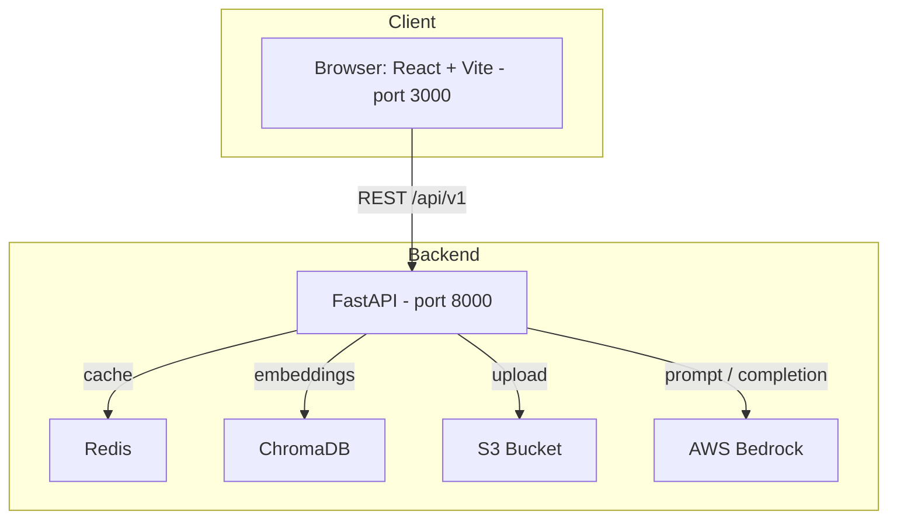

# Stori GenAI RAG Challenge 🚀

> A full‑stack Retrieval‑Augmented Generation (RAG) prototype that answers questions about the Mexican Revolution by combining semantic search in **ChromaDB** with **AWS Bedrock** large‑language models, all wrapped in a React front‑end.

[](https://fastapi.tiangolo.com/) 
[](https://react.dev/) 

---

## Table of Contents

1. [Project Overview](#project-overview)  
2. [Features](#features)  
3. [System Architecture](#system-architecture)  
4. [Tech Stack](#tech-stack)  
5. [Quick Start](#quick-start)  
6. [Configuration](#configuration)  
7. [Usage Guide](#usage-guide)  
8. [Metrics & Observability](#metrics--observability)  
9. [Future Improvements](#future-improvements)  
10. [License](#license)

---

## Project Overview

Stori’s GenAI team asked for a **conversational assistant** that can reason over internal material (here: a document on the Mexican Revolution), preserve multi‑turn context and expose extensible tooling—*all while being cloud‑ready*.  
This repository contains a reference implementation that:

* Ingests and chunks arbitrary documents (PDF, DOCX, XLSX, TXT&hellip;).  
* Stores embeddings in **ChromaDB** for low‑latency similarity search.  
* Generates concise answers with **Amazon Bedrock**—stream‑ready.  
* Tracks rich **metrics** (latency, likes/dislikes, tool usage, accuracy).  
* Ships as two lightweight Docker images (backend + frontend).

---

## Features

- **💬 Conversational RAG** – context‑aware answers in Spanish or English.  
- **🧠 Tooling Agents** – summarisation, intent classification, human escalation & content‑safety guardrails.  
- **📄 One‑click Document Upload** – drag‑and‑drop UI, automatic S3 backup.  
- **📈 Metrics Dashboard** – live KPIs with like‑ratio, error‑rate & retention.  
- **🏥 Health Check** – deep probes for Redis, Chroma and Bedrock.  
- **⚙️ Zero‑Config Local Run** – `./start.sh` builds & starts everything.  
<!-- - **☁️ Cloud Ready** – sample AWS CDK stack (VPC, ECS, ALB, ElastiCache). # TODO -->

---

## System Architecture
 <!-- # TODO AWS  -->


---

## Tech Stack

| Layer          | Technology                                                                                           |
|----------------|-------------------------------------------------------------------------------------------------------|
| **Front‑end**      |  React, TypeScript, TailwindCSS, Vite|
| **Back‑end**       |  FastAPI, LangChain, AWS Bedrock (Claude 3.5 Haiku)|
| **Vector DB**      |  ChromaDB (persistent mode)|
| **Cache / Memory** | Redis                  |
| **Infrastructure** | Docker Compose (local) & AWS CDK v2 (cloud) |
| **CI / Test**      | pytest, moto, black, flake8, isort|

---

## Quick Start

```bash
# 1. Clone
git clone https://github.com/enriquegomeztagle/stori-genai-rag.git

# 2. Configure
cp env.example .env               # Edit AWS credentials & Bedrock model id

# 3. Launch the full stack
./start.sh                        # Builds & runs via Docker Compose

# 4. Open
open http://localhost:3000        # React UI
open http://localhost:8000/docs   # Swagger / ReDoc
```

To stop everything:

```bash
docker compose down
```

---

## Configuration

Key environment variables (see `.env.example`):

| Variable                 | Description                               |
|--------------------------|-------------------------------------------|
| `AWS_ACCESS_KEY_ID`      | IAM key with Bedrock & S3 permissions     |
| `AWS_REGION`             | AWS region (Bedrock + S3)          |
| `BEDROCK_MODEL_ID`       | e.g. `anthropic.claude-3-5-haiku-20241022-v1:0` |
| `EMBEDDING_MODEL`        | e.g. `amazon.titan-embed-text-v1`         |
| `S3_BUCKET_NAME`         | Bucket where raw documents are optionally stored (disabled by default) |
| `REDIS_URL` / `REDIS_DB` | Redis connection string                   |
| `CHROMA_PERSIST_DIRECTORY`| Local path for Chroma vectors            |
---

> **Note:** Upload to S3 is turned **off** in the default code path.  
> To persist PDF files, set `S3_BUCKET_NAME` and change `upload_to_s3=False` to `True` in `backend/app/api/endpoints/documents.py`.

## Usage Guide

1. **Chat** – Navigate to **Home**, ask anything about the Mexican Revolution. Follow‑up questions reuse conversation memory.  
2. **Upload** – Drop new documents in *Upload* tab; chunks & embeddings are created automatically.  
3. **Metrics** – Inspect live performance in the *Metrics* tab.  
4. **Health** – Check component status in *Health* tab.

> **Tip:** The assistant politely refuses questions outside scope by design.

---

## Metrics & Observability

The backend records:

* **Latency & error rate** per response.  
* **Like / dislike** feedback loop.  
* **Tool effectiveness** (% likes when a tool is used).  
* **Conversation retention** (follow‑ups per session).

Metrics are surfaced via REST, persisted in‑memory (demo) and visualised in the React dashboard.

---
<!-- TODO -->
<!-- ## Deployment (AWS CDK)

A **CDK v2** stack (see `infrastructure/`—coming soon) provisions:

* **ECR** repositories and **ECS Fargate** services.  
* **Application Load Balancer** with HTTPS.  
* **ElastiCache Redis**, **S3** and **ChromaDB** on an EC2 micro (for demo).  
* IAM roles with least privilege for Bedrock runtime.

Run:

```bash
cd infrastructure
npm install
cdk deploy --all
``` -->

---

## Future Improvements

- [ ] Streaming responses.
- [ ] Authentication.
- [ ] Grafana dashboards fed by Prometheus exporter.  
- [ ] Automated CI/CD pipeline.

---

## License
This project is part of the Stori Technical Challenge.
