```mermaid
graph TD
  %% Clústeres y subgráficos
  subgraph Internet [Internet]
    A[Users]
  end

  subgraph VPC [AWS VPC]
    direction TB

    subgraph Public [Public Subnets]
      direction LR
      ALB_FE[ALB Frontend<br/>port 3000]
      ALB_BE[ALB Backend<br/>port 8000]
    end

    subgraph ECSCluster [ECS Cluster]
      direction TB

      subgraph Frontend [Frontend Task]
        FE[ECS Frontend Service<br/>Fargate: 256 CPU, 512 MB RAM]
      end

      subgraph Backend [Backend Task]
        BE[ECS Backend Service<br/>Fargate: 512 CPU, 1 GB RAM]
      end
    end

    subgraph Data [Data Layer]
      direction LR
      Redis[ElastiCache Redis<br/>t3.micro, Redis 7.0]
      EFS[EFS File System<br/>ChromaDB Persistence]
    end

    subgraph Services [AWS Services]
      direction LR
      subgraph ECR_Containers [ECR – Container Images]
        FE_Image[Frontend Image]
        BE_Image[Backend Image]
      end
      SM[Secrets Manager<br/>stori/rag/backend]
      S3[S3 – Document Storage]
      Bedrock[AWS Bedrock<br/>Claude 3.5 Haiku]
    end
  end

  %% Conexiones
  A -->|HTTPS| ALB_FE
  A -->|HTTPS| ALB_BE
  ALB_FE -->|HTTP| FE
  ALB_BE -->|HTTP| BE
  FE -->|VITE_API_URL| ALB_BE
  BE -->|Redis 6379| Redis
  BE -->|NFS 2049| EFS
  BE -->|IAM Auth| SM
  BE -->|S3 API| S3
  BE -->|Bedrock API| Bedrock

  %% Estilos
  classDef internet fill:#e1f5fe,stroke:#333,stroke-width:1px;
  classDef alb fill:#fff3e0,stroke:#333,stroke-width:1px;
  classDef ecs fill:#e8f5e8,stroke:#333,stroke-width:1px;
  classDef datastore fill:#fff8e1,stroke:#333,stroke-width:1px;
  classDef services fill:#e0f2f1,stroke:#333,stroke-width:1px;

  class A internet
  class ALB_FE,ALB_BE alb
  class FE,BE ecs
  class Redis,EFS datastore
  class ECR,SM,S3,Bedrock services
```

# Stori GenAI RAG Challenge 🚀

> A full‑stack Retrieval‑Augmented Generation (RAG) prototype that answers questions about the Mexican Revolution by combining semantic search in **ChromaDB** with **AWS Bedrock** large‑language models, all wrapped in a React front‑end.

> For cloud deployment, the project is deployed in AWS using AWS CDK v2, and uses **ECS Fargate** for container orchestration, **Application Load Balancer** for traffic distribution, **ElastiCache Redis** for caching, **EFS** for ChromaDB persistence, **S3** for document storage, **Secrets Manager** for secure configuration, and **AWS Bedrock** for LLM inference.

---

## Table of Contents

1. [Project Overview](#project-overview)
2. [Features](#features)
3. [System Architecture](#system-architecture)
4. [Tech Stack](#tech-stack)
5. [Quick Start](#quick-start)
6. [AWS Deployment](#aws-deployment)
7. [Configuration](#configuration)
8. [Usage Guide](#usage-guide)
9. [Metrics & Observability](#metrics--observability)
10. [Future Improvements](#future-improvements)
11. [License](#license)

---

## Project Overview

Stori's GenAI team asked for a **conversational assistant** that can reason over internal material (here: a document on the Mexican Revolution), preserve multi‑turn context and expose extensible tooling—*all while being cloud‑ready*.This repository contains a reference implementation that:

* Ingests and chunks arbitrary documents (PDF, DOCX, XLSX, TXT…).
* Stores embeddings in **ChromaDB** for low‑latency similarity search.
* Generates concise answers with **Amazon Bedrock**—stream‑ready.
* Tracks rich **metrics** (latency, likes/dislikes, tool usage, accuracy).
* Ships as two lightweight Docker images (backend + frontend).

---

## Features

- **💬 Conversational RAG** – context‑aware answers in Spanish or English.
- **🧠 Tooling Agents** – summarisation, intent classification, human escalation & content‑safety guardrails.
- **📄 One‑click Document Upload** – drag‑and‑drop UI, automatic S3 backup (optional).
- **📈 Metrics Dashboard** – live KPIs with like‑ratio, error‑rate & retention.
- **🏥 Health Check** – deep probes for Redis, Chroma and Bedrock.
- **⚙️ Zero‑Config Local Run** – `./start.sh` builds & starts everything.

---

## System Architecture

```mermaid
graph TD
    subgraph Client
        A[Browser: React + Vite - port 3000]
    end
    subgraph Backend
        A -->|REST /api/v1| B[FastAPI - port 8000]
        B -- cache --> C[Redis]
        B -- embeddings --> D[ChromaDB]
        B -- upload --> E[S3 Bucket]
        B -- prompt / completion --> F[AWS Bedrock]
    end
```

### Local



### Cloud



---

## Tech Stack

### Local

| Layer                    | Technology                                         |
| ------------------------ | -------------------------------------------------- |
| **Front‑end**     | React, TypeScript, TailwindCSS, Vite               |
| **Back‑end**      | FastAPI, LangChain, AWS Bedrock (Claude 3.5 Haiku) |
| **Vector DB**     | ChromaDB (persistent mode)                         |
| **Cache / Memory** | Redis                                              |
| **CI / Test**      | pytest, moto, black, flake8, isort                 |

### Cloud

| Layer                        | Technology                                                         |
| ---------------------------- | ------------------------------------------------------------------ |
| **Front‑end**         | React, TypeScript, TailwindCSS, Vite (Containerized)               |
| **Back‑end**          | FastAPI, LangChain, AWS Bedrock (Claude 3.5 Haiku) (Containerized) |
| **Vector DB**          | ChromaDB (persistent on EFS)                                       |
| **Cache / Memory**     | ElastiCache Redis (t3.micro, Redis 7.0)                            |
| **Storage**            | Amazon S3 (document storage), EFS (ChromaDB persistence)           |
| **Compute**            | ECS Fargate (serverless containers)                                |
| **Load Balancing**     | Application Load Balancer (ALB)                                    |
| **Networking**         | VPC with public/private subnets, Security Groups                   |
| **Container Registry** | ECR (Elastic Container Registry)                                   |
| **Secrets Management** | AWS Secrets Manager                                                |
| **Infrastructure**     | AWS CDK v2 (TypeScript/Python)                                     |
| **Monitoring**         | CloudWatch Container Insights                                      |

## Quick Start

```bash
# 1. Clone
git clone https://github.com/enriquegomeztagle/stori-genai-rag.git
cd stori-genai-rag

# 2. Configure
cp env.example .env               # Edit AWS credentials & Bedrock model id

# 3. Launch the full stack
./start.sh                        # Builds & runs via Docker Compose

# 4. Test locally (optional)
./test-local.sh                   # Verify everything is working

# 5. Open
open http://localhost:3000        # React UI
open http://localhost:8000/docs   # Swagger / ReDoc
```

To stop everything:

```bash
docker compose down
```

## AWS Deployment

### Prerequisites

1. **AWS CLI configured** with appropriate permissions
2. **AWS CDK installed**: `npm install -g aws-cdk`
3. **Python 3.12+** for CDK dependencies

### Setup Secrets

Before deploying, create the required AWS Secrets Manager secret:

1. **Create the secret** with the exact name `stori/rag/backend`:

```bash
aws secretsmanager create-secret \
  --name "stori/rag/backend" \
  --description "Stori RAG Backend Configuration" \
  --secret-string file://infrastructure/.secrets/stori-rag-backend-template.json
```

2. **Update the secret values** as needed:

```json
{
  "S3_BUCKET_NAME": "stori-documents",
  "EMBEDDING_MODEL": "amazon.titan-embed-text-v1",
  "BEDROCK_MODEL_ID": "anthropic.claude-3-5-haiku-20241022-v1:0",
  "DEFAULT_LANGUAGE": "es"
}
```

### Deploy Infrastructure

```bash
# Deploy the full stack to AWS
./deploy.sh
```

The deployment script will:

- Bootstrap CDK in your AWS account
- Create Python virtual environment
- Install dependencies
- Deploy the infrastructure stack
- Output the frontend and backend URLs

### Deployment Outputs

After successful deployment, you'll get:

- **Frontend URL**: Public ALB endpoint for the React app
- **Backend URL**: Public ALB endpoint for the FastAPI backend
- **Health Check**: Available at `{frontend-url}/health`

### Cleanup

To remove all deployed resources:

```bash
cd infrastructure
cdk destroy --force
```

---

## Configuration

Key environment variables (see `.env.example`):

| Variable                     | Description                                                            |
| ---------------------------- | ---------------------------------------------------------------------- |
| `AWS_ACCESS_KEY_ID`        | IAM key with Bedrock & S3 permissions                                  |
| `AWS_REGION`               | AWS region (Bedrock + S3)                                              |
| `BEDROCK_MODEL_ID`         | e.g.`anthropic.claude-3-5-haiku-20241022-v1:0`                       |
| `EMBEDDING_MODEL`          | e.g.`amazon.titan-embed-text-v1`                                     |
| `S3_BUCKET_NAME`           | Bucket where raw documents are optionally stored (disabled by default) |
| `REDIS_URL` / `REDIS_DB` | Redis connection string                                                |
| `CHROMA_PERSIST_DIRECTORY` | Local path for Chroma vectors                                          |

---

> **Note:** Upload to S3 is turned **off** in the default code path.
> To persist PDF files, set `S3_BUCKET_NAME` and change `upload_to_s3=False` to `True` in `backend/app/api/endpoints/documents.py`.

## Usage Guide

1. **Chat** – Navigate to **Home**, ask anything about the Mexican Revolution. Follow‑up questions reuse conversation memory.
2. **Upload** – Drop new documents in *Upload* tab; chunks & embeddings are created automatically.
3. **Metrics** – Inspect live performance in the *Metrics* tab.
4. **Health** – Check component status in *Health* tab.

> **Tip:** The assistant politely refuses questions outside scope by design.

---

## Metrics & Observability

The backend records:

* **Latency & error rate** per response.
* **Like / dislike** feedback loop.
* **Tool effectiveness** (% likes when a tool is used).
* **Conversation retention** (follow‑ups per session).

Metrics are surfaced via REST, persisted in‑memory (demo) and visualised in the React dashboard.

---

## Future Improvements

- [ ] **Streaming responses**: Implement streaming responses for better user experience.
- [ ] **Authentication**: Add login and logout functionality.
- [ ] **Vector Database Migration**: Replace EFS ChromaDB with OpenSearch or pgvector for better scalability and performance.
- [ ] **Granular IAM Permissions**: Implement least-privilege access with custom IAM policies instead of broad permissions.
- [ ] **Multi-Region Deployment**: Active-active setup with Route 53 failover for high availability.
- [ ] **Auto-scaling**: Implement ECS auto-scaling based on CPU/memory usage and custom metrics.
- [ ] **Document Processing Pipeline**: Implement async document processing with progress tracking.
- [ ] **Monitoring & Alerting**: CloudWatch custom alarms, and SNS notifications for critical issues.
- [ ] **Backup & Recovery**: Automated backups for EFS, S3 versioning, and disaster recovery procedures.
- [ ] **Security Enhancements**: WAF, VPC endpoints, encryption at rest/transit, and security scanning.
- [ ] **Grafana dashboards fed by Prometheus exporter.**
- [ ] **Fully Automated CI/CD pipeline.**

---

## License

This project was developed as part of the **Stori Technical Challenge** and is intended for evaluation purposes only.

### Copyright Notice

© 2025 Enrique Ulises Baez Gomez Tagle. All rights reserved.

### Usage Terms

- **Evaluation Only**: This codebase is created specifically for the Stori GenAI team's technical assessment
- **No Commercial Use**: This project may not be used for commercial purposes without explicit written permission
- **No Redistribution**: The code may not be redistributed, copied, or modified without authorization
- **Attribution Required**: Any reference to this work must include proper attribution to the author

### Intellectual Property

This project represents original work developed independently for the Stori challenge. The architecture, implementation, and design decisions are the intellectual property of the author.

### Contact

For questions regarding this project or licensing, please contact:

- **Author**: Enrique Ulises Baez Gomez Tagle
- **GitHub**: [@enriquegomeztagle](https://github.com/enriquegomeztagle)
- **Purpose**: Stori Technical Challenge Submission

---

## Author

- [@enriquegomeztagle](https://github.com/enriquegomeztagle)
