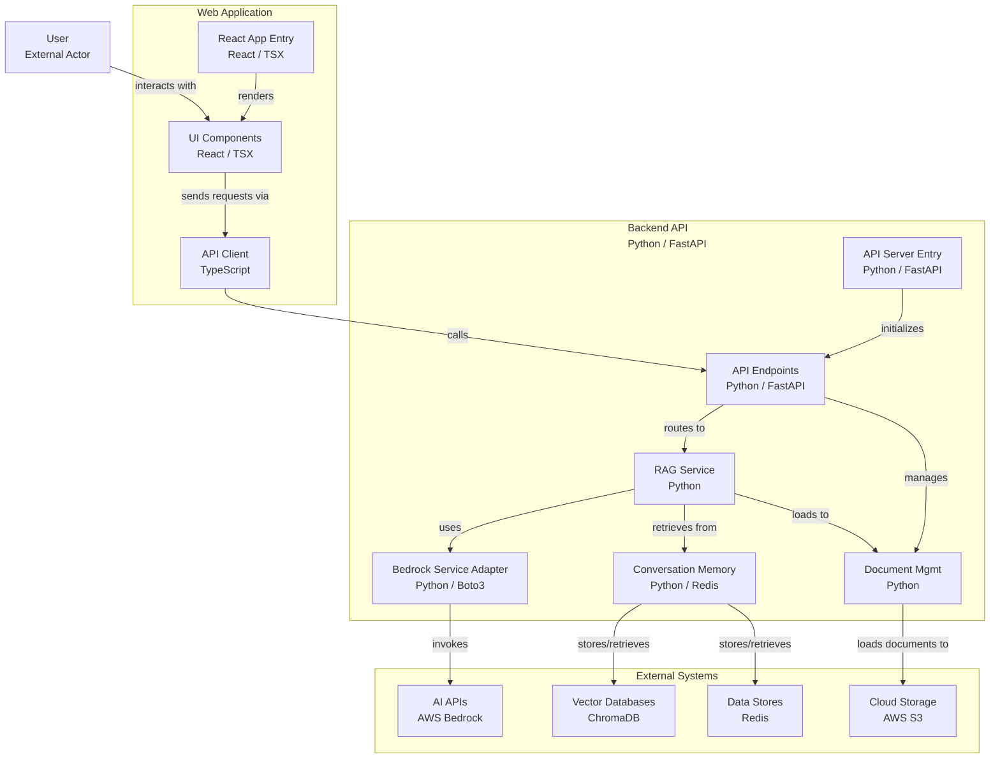

# System Design

## Architecture Overview

The solution adopts a clean two‑tier pattern. A **React + Vite** single‑page application (served on port 3000) handles all user interaction—chatting, document upload and metric visualisation.  Requests flow over HTTPS/REST to a **FastAPI** backend (port 8000) that exposes versioned endpoints under `/api/v1`, keeping the client stateless and the transport simple.

Inside the backend, the Retrieval‑Augmented‑Generation pipeline fans out to four specialised services: **Redis** stores conversation turns and cached summaries; **ChromaDB** holds vector embeddings for low‑latency semantic search; **AWS Bedrock** (Claude 3.5 Haiku) provides generation, intent classification and safety checks; and **Amazon S3** (optional in local runs) keeps raw documents for durable backup.  Orchestration happens in `RAGService`, which retrieves relevant chunks from Chroma, injects recent dialogue from Redis, calls Bedrock, and returns a concise answer to the client.

Below is the equivalent Mermaid diagram.

## Design Trade‑offs and Assumptions

| Decision | Rationale | Implication |
|----------|-----------|-------------|
| **Local persistent ChromaDB** | Easiest to run in Docker Compose without managed services. | Not highly available; single‑node persistence only. |
| **In‑memory metrics (Python lists)** | Fast to prototype; zero external state. | Metrics reset on container restart; not horizontally scalable. |
| **Fixed chunk size = 1000 chars / overlap = 200** | Balances recall vs. indexing speed for mixed‑format docs. | May under‑segment very long paragraphs; tuning needed for other corpora. |
| **S3 upload disabled by default** | Simplifies local setup; no AWS creds required to test. | Original files are not durably stored unless the flag is flipped. |
| **Last‑6 message context window** | Lightweight memory that avoids prompt bloat. | Older context drops off; nuance may be lost in long chats. |

## Future Improvements (If Given More Time)

1. **CDK Deployment** – Complete the IaC stack: ECS Fargate, ALB with TLS, ElastiCache Redis, persistent Chroma, IAM roles.  
2. **Streaming Responses** – Switch to Server‑Sent Events or WebSocket for token‑level streaming.  
3. **Persistent Metrics Store** – Move metrics to PostgreSQL + Grafana dashboards.  
4. **Retrieval Enhancements** – Dynamic chunking, hybrid semantic+keyword search, reranking with a cross‑encoder.  
5. **Authentication & RBAC** – Cognito‑backed JWTs and per‑user namespaces in Redis/Chroma.  
6. **Observability** – OpenTelemetry tracing and structured logs shipped to CloudWatch/Datadog.  
7. **Autoscaling & Caching** – Front cache for embeddings, RAG caching layer, and horizontal pod autoscaling.  
8. **Automated CI/CD** – GitHub Actions: lint, test, build, push to ECR, CDK deploy.
