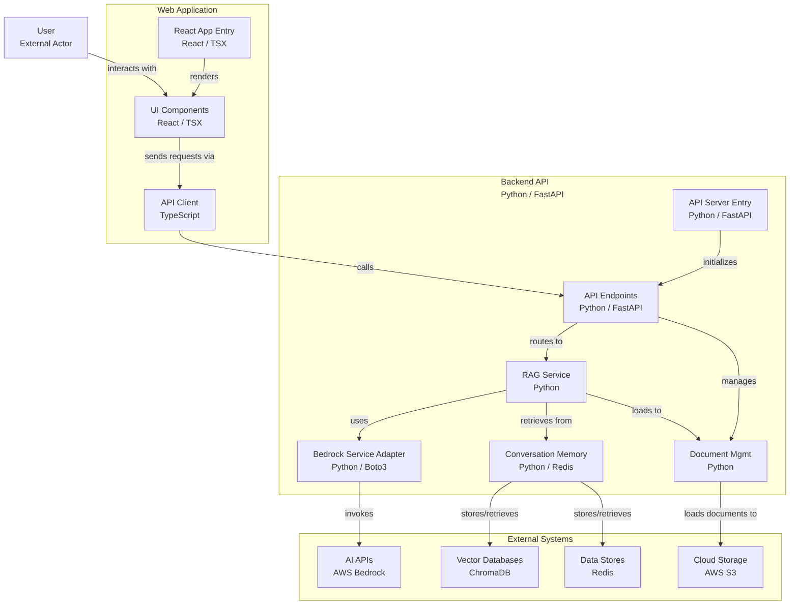
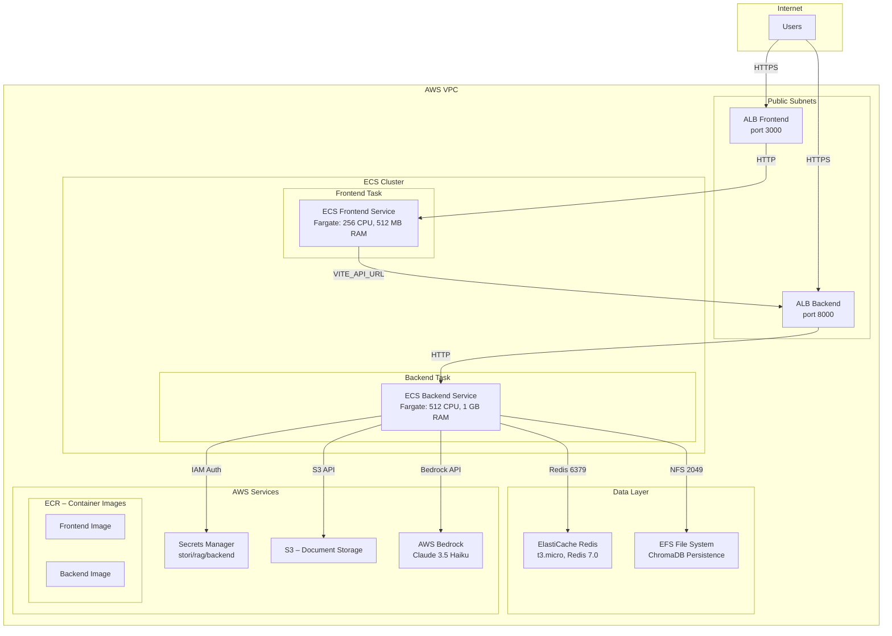

# System Design
## Local
### Architecture Overview
The solution adopts a clean two‑tier pattern. A **React + Vite** single‑page application (served on port 3000) handles all user interaction—chatting, document upload and metric visualisation.  Requests flow over HTTPS/REST to a **FastAPI** backend (port 8000) that exposes versioned endpoints under `/api/v1`, keeping the client stateless and the transport simple.

Inside the backend, the Retrieval‑Augmented‑Generation pipeline fans out to four specialised services: **Redis** stores conversation turns and cached summaries; **ChromaDB** holds vector embeddings for low‑latency semantic search; **AWS Bedrock** (Claude 3.5 Haiku) provides generation, intent classification and safety checks; and **Amazon S3** (optional) keeps raw documents for durable backup.  Orchestration happens in `RAGService`, which retrieves relevant chunks from Chroma, injects recent dialogue from Redis, calls Bedrock, and returns a concise answer to the client.

Below is the equivalent Mermaid diagram.

### Design Trade‑offs and Assumptions

| Decision | Rationale | Implication |
|----------|-----------|-------------|
| **Local persistent ChromaDB** | Easiest to run in Docker Compose without managed services. | Not highly available; single‑node persistence only. |
| **In‑memory metrics (Python lists)** | Fast to prototype; zero external state. | Metrics reset on container restart; not horizontally scalable. |
| **Fixed chunk size = 1000 chars / overlap = 200** | Balances recall vs. indexing speed for mixed‑format docs. | May under‑segment very long paragraphs; tuning needed for other corpora. |
| **Last‑6 message context window** | Lightweight memory that avoids prompt bloat. | Older context drops off; nuance may be lost in long chats. |

## Cloud
### Architecture Overview
The cloud architecture is designed to be scalable, secure, and resilient, deploying all components on AWS and leveraging managed services for storage, compute, and networking.

Frontend and backend run in containers orchestrated by ECS Fargate, exposed via Application Load Balancer (ALB). Redis and ChromaDB persist on ElastiCache and EFS, respectively. Documents are stored in S3 and credentials/configuration in Secrets Manager. The LLM model is consumed via AWS Bedrock.

### Cloud system description
- **Frontend**: React + Vite, deployed on ECS Fargate, exposed via ALB (port 3000).
- **Backend**: FastAPI, deployed on ECS Fargate, exposed via ALB (port 8000), integrates LangChain and orchestrates the RAG logic.
- **Vector DB**: Persistent ChromaDB on EFS, accessible from the backend.
- **Cache/Memory**: Managed Redis (ElastiCache), for conversational context and caching.
- **Storage**: S3 for documents, EFS for vector persistence.
- **Security**: Secrets Manager for credentials/configuration, IAM roles with least privilege.
- **LLM**: AWS Bedrock (Claude 3.5 Haiku) for generation, classification, and safety checks.
- **Network**: VPC with public and private subnets, restrictive security groups.
- **Orchestration**: ECS Fargate for scalability and serverless deployment.

### Cloud trade-offs and considerations
| Decision | Rationale | Implication |
|----------|-----------|-------------|
| **ECS Fargate** | Serverless deployment, no server management | Pay-per-use cost, possible cold starts |
| **ALB for frontend/backend** | Centralized TLS security and load balancing | Additional configuration, ALB cost |
| **ElastiCache Redis** | Managed cache and memory, high availability | Cost and instance limits |
| **ChromaDB on EFS** | Persistence without data loss between deployments | Network latency, not optimal for very high loads |
| **S3 for documents** | Durable and scalable storage | Access latency, storage and access costs |
| **Secrets Manager** | Secure secrets and configuration management | Cost per secret, IAM integration |
| **Bedrock API** | Managed LLM, no infrastructure management | Pay-per-use cost, AWS dependency |
| **VPC and SGs** | Network isolation and control | Configuration complexity |

# Future Improvements (If Given More Time)

- [ ] **Streaming responses**: Implement streaming responses for better user experience.
- [ ] **Authentication**: Add login and logout functionality.
- [ ] **Vector Database Migration**: Replace EFS ChromaDB with OpenSearch or pgvector for better scalability and performance.
- [ ] **Granular IAM Permissions**: Implement least-privilege access with custom IAM policies instead of broad permissions.
- [ ] **Multi-Region Deployment**: Active-active setup with Route 53 failover for high availability.
- [ ] **Auto-scaling**: Implement ECS auto-scaling based on CPU/memory usage and custom metrics.
- [ ] **Document Processing Pipeline**: Implement async document processing with progress tracking.
- [ ] **Monitoring & Alerting**: CloudWatch custom alarms, and SNS notifications for critical issues.
- [ ] **Backup & Recovery**: Automated backups for EFS, S3 versioning, and disaster recovery procedures.
- [ ] **Security Enhancements**: WAF, VPC endpoints, encryption at rest/transit, and security scanning.
- [ ] **Grafana dashboards fed by Prometheus exporter.**
- [ ] **Fully Automated CI/CD pipeline.**
